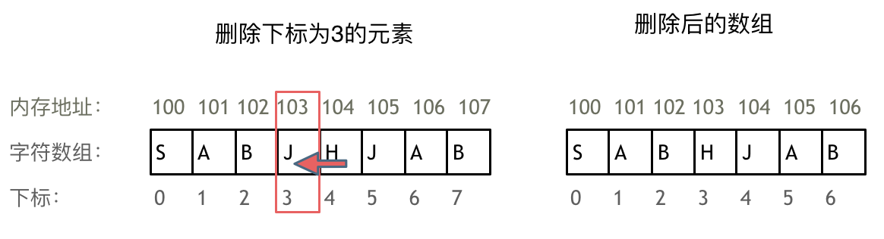

# 数组Array和相关考点
数组可能的考点：
* 遍历
* 二分查找
* 双指针
* 前缀和
* 排序
  * 递归
  * 分治
## 数组基础知识
数组：数组是存放在**连续内存空间**上的**相同类型数据**的集合，可以方便地通过下标索引的方式获取到下标下对应的数据。
但同时，因为数组的在内存空间的地址是连续的，所以我们在删除或者增添元素的时候，就难免要移动其他元素的地址。

* 数组不能被删除，只能被覆盖。删除非尾部数据的时候，就需要移动该元素后面的全部元素。

* 二维数组就是数组的数组，C++中地址空间是连续的，而Java中并不连续。

## 数组有关的考点
### 二分查找
二分法的两种写法（用边界位置分类）：
* target 存在在一个在左闭右闭的区间[left, right]里，这时候：
  * while (left <= right) 要使用 <= ，因为left == right是有意义的，所以使用 <=
  * if (nums[middle] > target) right 要赋值为 middle - 1，因为当前这个nums[middle]一定不是target，那么接下来要查找的左区间结束下标位置就是 middle - 1
* target 存在在一个在左闭右开的区间[left, right)里，这时候：
  * while (left < right)，这里使用 < ,因为left == right在区间[left, right)是没有意义的
  * if (nums[middle] > target) right 更新为 middle，因为当前nums[middle]不等于target，去左区间继续寻找，而寻找区间是左闭右开区间，所以right更新为middle，即：下一个查询区间不会去比较nums[middle]
#### 704. 二分查找
使用左闭右闭区间
```java
class Solution {
    public int search(int[] nums, int target) {
        int left = 0, right = nums.length - 1;
        while (left <= right){
            int mid = (right + left) / 2;
            if (nums[mid] > target){
                right = mid - 1;
            }else if (nums[mid] < target){
                left = mid + 1;
            }else{
                return mid;
            }
        }
        return -1;
    }
}
```
使用左闭右开区间
```java
class Solution {
    public int search(int[] nums, int target) {
        int left = 0, right = nums.length;
        while (left < right){
            int mid = (left + right) / 2;
            if (nums[mid] == target){
                return mid;
            }else if (nums[mid] > target){
                right = mid;
            }else{
                left = mid + 1;
            }
        }
        return -1;
    }
}
```

