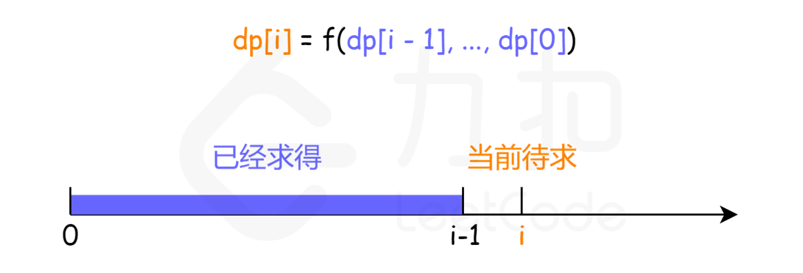

# 动态规划
## 简介

## 线性动态规划

### 单串
单串 dp[i] 线性动态规划最简单的一类问题，输入是一个串，状态一般定义为 dp[i] := 考虑[0..i]上，原问题的解，其中 i 位置的处理，根据不同的问题，主要有两种方式：
* 第一种是 i 位置必须取，此时状态可以进一步描述为 dp[i] := 考虑[0..i]上，且取 i，原问题的解；
* 第二种是 i 位置可以取可以不取
大部分的问题，对 i 位置的处理是第一种方式。

#### 1. 依赖比 i 小的 O(1) 个子问题
dp[n] 只与常数个小规模子问题有关，状态的推导过程 dp[i] = f(dp[i - 1], dp[i - 2], ...)。时间复杂度O(n)，空间复杂度O(n) 可以优化为O(1)，例如上面提到的 70, 801, 790, 746 都属于这类。

[53. 最大子数组和](https://leetcode.cn/problems/maximum-subarray)
```java
class Solution {
    public int maxSubArray(int[] nums) {
        int pre = 0, ans = nums[0];
        int n = nums.length;
        for (int i = 0; i<n; i++){
            pre = Math.max(nums[i] + pre, nums[i]);
            ans = Math.max(pre, ans);
        }
        return ans;
    }
}
```
#### 2. 依赖比 i 小的 O(n) 个子问题
dp[n] 与此前的更小规模的所有子问题 dp[n - 1], dp[n - 2], ..., dp[1] 都可能有关系。 依然如图所示，计算橙色的当前状态 dp[i] 时，紫色的此前计算过的状态 dp[i-1], ..., dp[0] 均有可能用到，在计算 dp[i] 时需要将它们遍历一遍完成计算。
其中 f 常见的有 max/min，可能还会对 i-1,i-2,...,0 有一些筛选条件，但推导 dp[n] 时依然是 O(n) 级的子问题数量。
例如：
* 139 单词拆分
* 818 赛车

[53. 最大子数组和](https://leetcode.cn/problems/maximum-subarray/description/)
```java
class Solution {
    public int lengthOfLIS(int[] nums) {
        int n = nums.length;
        if (n == 0) return 0;
        int[] dp = new int[n];
        dp[0] = 1;
        int ans = 1;
        for (int i = 1; i<n; i++){
            int maxans = 0;
            for (int j = 0; j<i; j++){
                if (nums[j] < nums[i] && dp[j] > maxans) 
                    maxans = dp[j];
            }
            dp[i] = maxans + 1;
            ans = Math.max(dp[i], ans);
        }
        return ans;
    }
}
```

单串相关练习题
1. [最经典单串 LIS 系列](./单串LIS系列.md)
2. 最大子数组和系列
3. 打家劫舍系列
4. 变形：需要两个位置的情况
5. 与其它算法配合
6. 其它单串 dp[i] 问题
7. 带维度单串 dp[i][k]
8. 股票系列