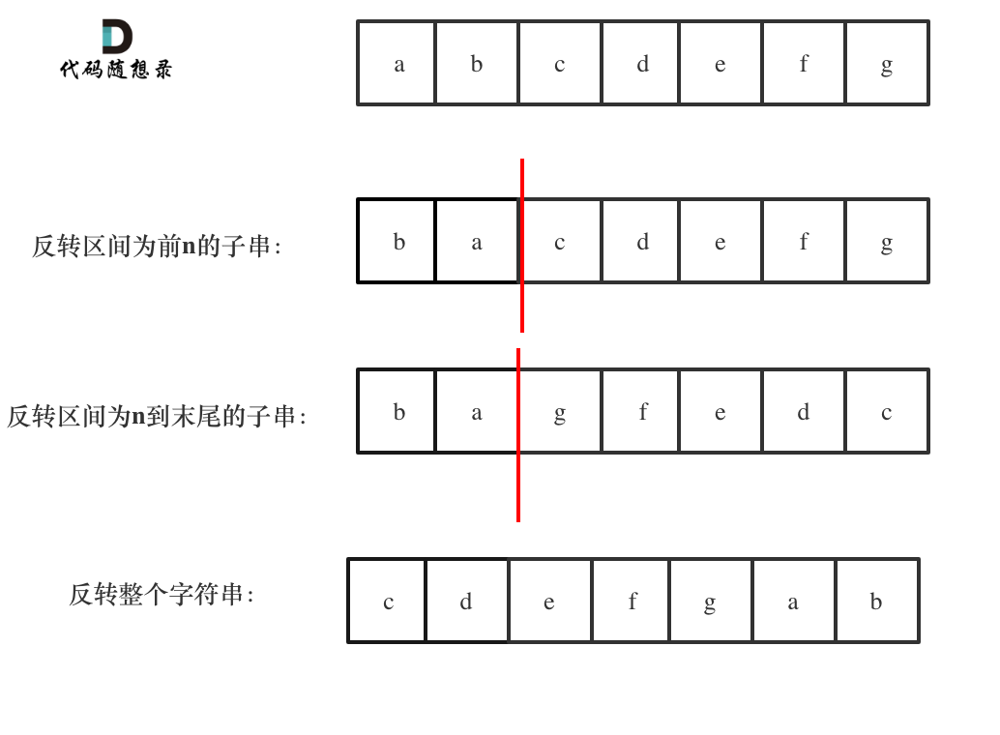

# 字符串
## Java中字符串的用法
### StringBuffer class in Java

1. append方法：在字符串后添加字符串
2. insert方法：在字符串的某一位置添加
3. replace方法：在某一位置替换
4. delete方法：删除一部分字符
5. reserve方法：反转字符串
6. length方法：现在的字符串长度

### String to Char[]
用以下方法把字符串转成字符数组，方便对字符串进行操作
```java
char[] arr = s.toCharArray();
String s = new String(arr);
```

## 题目练习
### [344. 反转字符串](https://leetcode.cn/problems/reverse-string/description/)
双指针循环替换
```java
class Solution {
    public void reverseString(char[] s) {
        int n = s.length;
        for (int i = 0; i < n / 2; i++){
            char tmp = s[i];
            s[i] = s[n-i-1];
            s[n-1-i] = tmp;
        }
    }
}
```
### [541. 反转字符串II](https://leetcode.cn/problems/reverse-string-ii/description/)
还是用双指针模拟，这里注意好指针范围即可。
```java
class Solution {
    public String reverseStr(String s, int k) {
        char[] charArray = s.toCharArray();
        int n = s.length();
        for (int i = 0; i<n; i = i + 2 * k){
            if (n - i >= k){
                for (int j = i; j < (2 * i + k) / 2; j++){
                    char tmp = charArray[j];
                    charArray[j] = charArray[2*i+k-j-1];
                    charArray[2*i+k-j-1] = tmp;
                }
            }else{
                for (int j = i; j < (i + n) / 2; j++){
                    char tmp = charArray[j];
                    charArray[j] = charArray[n + i - j - 1];
                    charArray[n + i - j - 1] = tmp;
                }
            }
        }
        return new String(charArray);
    }
}
```
### [剑指 Offer 05. 替换空格](https://leetcode.cn/problems/ti-huan-kong-ge-lcof/)
利用O(n)的额外空间，遍历原指针并且创建新指针
```java
//使用一个新的对象，复制 str，复制的过程对其判断，是空格则替换，否则直接复制，类似于数组复制
public static String replaceSpace(String s) {
    if (s == null) {
        return null;
    }
    //选用 StringBuilder 单线程使用，比较快，选不选都行
    StringBuilder sb = new StringBuilder();
    //使用 sb 逐个复制 s ，碰到空格则替换，否则直接复制
    for (int i = 0; i < s.length(); i++) {
        //s.charAt(i) 为 char 类型，为了比较需要将其转为和 " " 相同的字符串类型
        //if (" ".equals(String.valueOf(s.charAt(i)))){}
        if (s.charAt(i) == ' ') {
        sb.append("%20");
        } else {
        sb.append(s.charAt(i));
        }
    }
        return sb.toString();
}
```
不利用额外空间（C++），java这里还是用了StringBuilder。用一个双指针，从后往前填充。
```java
//方式二：双指针法
public String replaceSpace(String s) {
    if(s == null || s.length() == 0){
        return s;
    }
    //扩充空间，空格数量2倍
    StringBuilder str = new StringBuilder();
    for (int i = 0; i < s.length(); i++) {
        if(s.charAt(i) == ' '){
            str.append("  ");
        }
    }
    //若是没有空格直接返回
    if(str.length() == 0){
        return s;
    }
    //有空格情况 定义两个指针
    int left = s.length() - 1;//左指针：指向原始字符串最后一个位置
    s += str.toString();
    int right = s.length()-1;//右指针：指向扩展字符串的最后一个位置
    char[] chars = s.toCharArray();
    while(left>=0){
        if(chars[left] == ' '){
            chars[right--] = '0';
            chars[right--] = '2';
            chars[right] = '%';
        }else{
            chars[right] = chars[left];
        }
        left--;
        right--;
    }
    return new String(chars);
}
```
### [151. 反转字符串中的单词](https://leetcode.cn/problems/reverse-words-in-a-string/description/)
可以直接用split+reverse，也可以用ArrayDeque手动实现
```java
class Solution {
    public String reverseWords(String s) {
        // 除去开头和末尾的空白字符
        s = s.trim();
        // 正则匹配连续的空白字符作为分隔符分割
        List<String> wordList = Arrays.asList(s.split("\\s+"));
        Collections.reverse(wordList);
        return String.join(" ", wordList);
    }
}
```
### [剑指 Offer 58 - II. 左旋转字符串](https://leetcode.cn/problems/zuo-xuan-zhuan-zi-fu-chuan-lcof/description/)
直接遍历
```java
class Solution {
    public String reverseLeftWords(String s, int n) {
        StringBuffer sb = new StringBuffer();
        int len = s.length();
        char[] charArray = s.toCharArray();
        for (int i = n; i < len; i++){
            sb.append(charArray[i]);
        }
        for (int i = 0; i<n; i++){
            sb.append(charArray[i]);
        }
        return sb.toString();
    }
}
```
如果添加必须在原地操作，不适用额外空间。可以用三次反转来实现。

具体步骤为：
1. 反转区间为前n的子串
2. 反转区间为n到末尾的子串
3. 反转整个字符串
最后就可以达到左旋n的目的，而不用定义新的字符串，完全在本串上操作。

```java
class Solution {
    public String reverseLeftWords(String s, int n) {
        int len=s.length();
        StringBuilder sb=new StringBuilder(s);
        reverseString(sb,0,n-1);
        reverseString(sb,n,len-1);
        return sb.reverse().toString();
    }
     public void reverseString(StringBuilder sb, int start, int end) {
        while (start < end) {
            char temp = sb.charAt(start);
            sb.setCharAt(start, sb.charAt(end));
            sb.setCharAt(end, temp);
            start++;
            end--;
            }
        }
}
```

### [28. 找出字符串中第一个匹配项的下标](https://leetcode.cn/problems/find-the-index-of-the-first-occurrence-in-a-string/description/)
用一个朴素方法直接匹配就可以解决，本题也可以拓展使用KMP算法，可以从O(M*N)优化到O(M+N)
```java
class Solution {
    public int strStr(String ss, String pp) {
        int n = ss.length(), m = pp.length();
        char[] s = ss.toCharArray(), p = pp.toCharArray();
        // 枚举原串的「发起点」
        for (int i = 0; i <= n - m; i++) {
            // 从原串的「发起点」和匹配串的「首位」开始，尝试匹配
            int a = i, b = 0;
            while (b < m && s[a] == p[b]) {
                a++;
                b++;
            }
            // 如果能够完全匹配，返回原串的「发起点」下标
            if (b == m) return i;
        }
        return -1;
    }
}
```

## 总结
字符串考点：
1. StringBuffer和StringBuilder的使用，单线程使用StringBuilder很快
2. 反转字符串，还有反转字符串的应用
3. KMP算法(可选)
